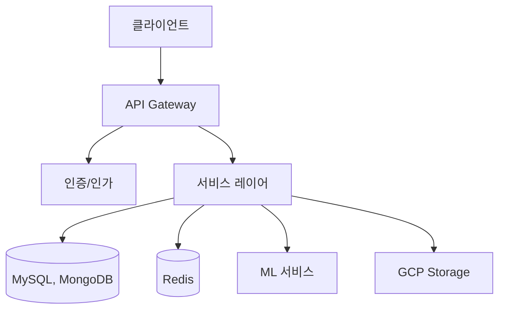

# SuperLawVA 백엔드 🏛️

<div align="center">
  
  
  **AI 기반 법률 지원 서비스의 백엔드 시스템**


</div>

## 📋 목차 (Table of Contents)

- [소개 (Introduction)](#소개-introduction)
- [시스템 아키텍처 (System Architecture)](#시스템-아키텍처-system-architecture)
- [주요 기능 (Key Features)](#주요-기능-key-features)
- [기술 스택 (Tech Stack)](#기술-스택-tech-stack)
- [시작하기 (Getting Started)](#시작하기-getting-started)
- [API 문서 (API Documentation)](#api-문서-api-documentation)
- [프로젝트 구조 (Project Structure)](#프로젝트-구조-project-structure)

## 소개 (Introduction)

SuperLawVA 백엔드는 AI 기반 법률 지원 서비스의 서버 시스템입니다. 계약서 분석, 법률 문서 생성, 법률 상담 챗봇 등 다양한 법률 서비스를 위한 API를 제공하며, 안정적이고 확장 가능한 아키텍처를 기반으로 구축되었습니다.

## 시스템 아키텍처 (System Architecture)



## 주요 기능 (Key Features)

### 📄 계약서 분석 (Contract Analysis)

- AI 기반 계약서 자동 분석 API
- OCR을 통한 문서 텍스트 추출
- 계약서 위험 요소 분석 및 평가

### 💬 법률 상담 챗봇 (Legal Chatbot)

- 실시간 법률 상담 세션 관리
- 대화 기록 저장 및 분석
- AI 기반 법률 조언 생성

### ✍️ 법률 문서 생성 (Legal Document Generation)

- 맞춤형 계약서 템플릿 생성
- 문서 버전 관리 및 이력 추적
- PDF 변환 및 전자서명 지원

### 🔐 보안 및 인증 (Security & Authentication)

- JWT 기반 사용자 인증
- OAuth2.0 소셜 로그인
- 암호화된 데이터 저장

## 기술 스택 (Tech Stack)

### Backend Framework & Language

- Spring Boot 3.x
- Java 17
- Gradle

### 데이터베이스 (Database)

- MySQL (유저 데이터 및 기타 데이터)
- MongoDB (조인이 많거나 null이 많은 자료: 계약서, 계약서 분석, 내용증명서)
- Redis (캐싱 및 세션 관리)

### 클라우드 및 인프라 (Cloud & Infrastructure)

- Google Cloud Platform (GCP)
- Docker
- Docker Compose

### 보안 (Security)

- Spring Security
- JWT
- OAuth2.0

### 모니터링 & 로깅 (Monitoring & Logging)

- Logback
- S3 로그 저장
- 커스텀 로깅 시스템

## 시작하기 (Getting Started)

### 사전 요구사항 (Prerequisites)

- Java 17 이상
- Docker & Docker Compose
- MySQL
- MongoDB
- Redis

### 설치 및 실행 (Installation & Running)

1. **저장소 클론**

```bash
git clone https://github.com/SuperLawVA/back.git
cd back
```

2. **환경 변수 설정**

```bash
cp .env.example .env
# .env 파일을 적절히 수정
```

3. **데이터베이스 실행**

```bash
docker-compose -f docker-compose-mysql.yml up -d
docker-compose -f docker-compose-mongodb.yml up -d
docker-compose -f docker-compose.redis.yml up -d
```

4. **애플리케이션 빌드 및 실행**

```bash
./gradlew build
java -jar build/libs/back-0.0.1-SNAPSHOT.jar
```

## API 문서 (API Documentation)

API 문서는 Swagger UI를 통해 제공됩니다. 서버 실행 후 아래 URL에서 확인할 수 있습니다:

```
http://localhost:8080/swagger-ui/index.html
```

## 프로젝트 구조 (Project Structure)

```
back/
├── src/
│   ├── main/
│   │   ├── java/
│   │   │   └── com/
│   │   │       └── superlawva/
│   │   │           ├── domain/         # 도메인별 패키지
│   │   │           │   ├── alarm/      # 알람 관련
│   │   │           │   ├── chatbot/    # 챗봇 관련
│   │   │           │   ├── document/   # 문서 관련
│   │   │           │   └── user/       # 사용자 관련
│   │   │           └── global/         # 공통 설정 및 유틸
│   │   └── resources/
│   └── test/
├── gradle/
└── docker/
```

<div align="center">
  Made with ❤️ by SuperLawVA Team
</div>
